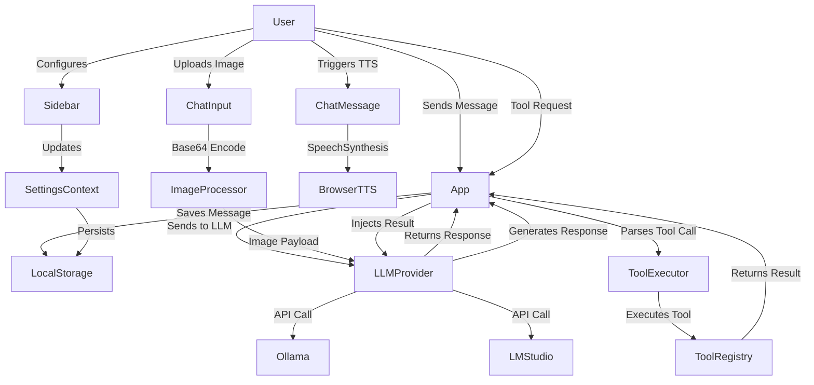

# Application Functional Blueprint

A comprehensive analysis of the AI Chat Application's functionality and features.

---

## Table of Contents
1. [Chat System](#chat-system)
2. [AI/LLM Integration](#aillm-integration)
3. [Audio/Text-to-Speech](#audiotext-to-speech)
4. [Settings & Configuration](#settings--configuration)
5. [Data Management](#data-management)
6. [User Interface Interactions](#user-interface-interactions)
7. [Multimodal/Vision Capabilities](#multimodalvision-capabilities)
8. [Tool Calling & RAG Integration](#tool-calling--rag-integration)

---

## Chat System

### Message Management
- **Message Types**: Supports three roles - `user`, `assistant`, and `system` messages
- **Branching Conversation Model**: Uses a tree-based data structure where:
  - Each message is a `MessageNode` with a unique ID
  - Messages have `parentId` and `childrenIds` for branching
  - Users can navigate through conversation branches by forking from any message
- **Message Editing**: Users can edit any previous message, which triggers a new branch from that point
- **Message Content**: Supports rich text content including:
  - Markdown rendering with tables, blockquotes, and links
  - Code blocks with syntax highlighting and copy-to-clipboard functionality
  - Tables with responsive overflow handling
  - Image content for vision model responses

### Conversation Features
- **Fork/Branch Conversations**: Create new conversation paths from any message
- **Retry Last Response**: Regenerate the AI's response to the last user message
- **Continue Generation**: Extend the last AI response with additional content
- **Clear Chat**: Reset the conversation to start fresh
- **Empty State**: Welcome screen with feature highlights when no messages exist

### Message Actions (per message)
- **Edit Message**: Inline editing that forks the conversation when saved
- **Fork From Here**: Start a new branch from the selected message
- **Text-to-Speech Playback**: Listen to the message content (see TTS section)

---

## AI/LLM Integration

### Provider Support
- **Ollama**: Local LLM provider with REST API at `/api/ollama`
- **LM Studio**: Local LLM provider to use both: the TypeScript SDK for model discovery/load/unload inside app code, and the native LM Studio REST API for stateful chat and rich streaming events. The SDK is first-class for TypeScript and explicitly supports loading, configuring, and unloading models from memory, while the native REST API is the one LM Studio documents for stateful chats and branching via response_id.

Best split
The TypeScript SDK is designed for Node.js and TypeScript apps and supports browser and Node-compatible environments, with features including using LLMs, tool use, and loading/configuring/unloading models from memory. The SDK docs also say .model("model-key") will use an existing loaded model or load it if needed, .load("model-key") loads a new instance, and model.unload() removes it from memory.

For chats, LM Studio’s native /api/v1/chat endpoint is stateful by default, returns a response_id, and lets you continue a conversation by sending previous_response_id; the docs also say this enables branching from specific prior points in a conversation. That is exactly the behavior you said you want for context retention and chat branches.

Models in TypeScript
If your UI needs “downloaded models” and “loaded models,” the TypeScript docs expose methods for both local-model discovery and loaded-model inspection. The SDK docs list listLocalModels for locally available models and listLoaded for models currently in memory.

That means your app can keep model management strongly typed and ergonomic in TypeScript, while still using LM Studio-native concepts like multiple model instances and explicit unload behavior. It is a cleaner fit than shelling out to the CLI for runtime app behavior.

Chats and telemetry
For telemetry like model-load progress, prompt-processing progress, and generation stream handling, the native REST side is still the better fit because LM Studio documents those streaming event capabilities on /api/v1/chat. The stateful chats doc also makes clear that chat state lives server-side unless you disable storage with store: false, so you do not need to resend the full message history every turn.

If your app needs a proper branchable conversation tree, keep your own app-side graph keyed by LM Studio response_id values. LM Studio gives you the stateful continuation primitive, and your TypeScript app should add the UX layer: branches, titles, pinned checkpoints, and restoring prior nodes.

Recommended architecture
Use the TypeScript SDK for:

Listing downloaded models.

Listing loaded models.

Loading a model instance.

Unloading a model instance.

Use the native LM Studio REST API for:

Stateful chats with response_id and previous_response_id.

Branching conversations.

Streaming operational events for chat execution.

 the cleanest TypeScript desktop architecture, treat the SDK as your control plane and the native REST API as your conversation/runtime plane. That gives you TypeScript-friendly model operations plus LM Studio’s best chat semantics and event streaming, without forcing everything through one abstraction.

If you want, I can next give you a concrete TypeScript service layer design with:

ModelService via SDK,

ChatService via REST/SSE,

TelemetryService,

and the exact interfaces/types for branchable chat state.

### Model Management
- **List Available Models**: Fetch models from the selected provider
- **Model Selection**: Choose from available local models via dropdown
- **Model Refresh**: Refresh the model list to detect newly loaded models
- **Model Unload/Eject**: Unload a model from memory (provider-specific implementation)

### Chat Configuration
- **Temperature Control**: Adjusts response randomness (passed to LLM provider)
- **Max Tokens**: Limits response length (passed to LLM provider)
- **System Prompt**: Configurable instructions that define AI behavior
- **User Persona**: Optional description of the user's context/preferences

### Error Handling
- **Provider Errors**: Toast notifications for connection failures
- **Model Errors**: Notifications when models are unavailable
- **Chat Errors**: Error display when AI responses fail

---

## Audio/Text-to-Speech

### Speech Synthesis
- **Browser-Based TTS**: locally ran Omnivoice TTS 
- **Voice Selection**: Separate voice selection for:
  - AI messages (AI Voice setting)
  - User messages (User Voice setting)
- **Voice Discovery**: Loads available system voices dynamically
- **Default Voice**: Falls back to system default if no specific voice is selected

### Playback Controls
- **Play Message**: Start TTS playback for any message
- **Stop Playback**: Cancel ongoing speech synthesis
- **Auto-Read AI**: Automatically read AI responses when received
- **Auto-Read User**: Automatically read user messages when sent

### Voice Parameters
- **Speed/Rate**: Adjust speech playback speed (0.5x to 2.0x)
- **Pitch**: Adjust voice pitch (0.5 to 2.0)
- **Per-Message Override**: Each message can be played with different voice settings

### Playback State
- **Speaking Indicator**: Visual feedback when TTS is active
- **Current Message Tracking**: Highlights which message is being spoken
- **Automatic State Cleanup**: Stops speech when component unmounts

---

## Settings & Configuration

### Backend Configuration
- **Provider Selection**: Toggle between Ollama and LM Studio backends

### Model Settings
- **Model Dropdown**: Select from available local models
- **Refresh Button**: Re-fetch available models from the provider

### Persona Settings
- **System Prompt**: Text area for defining AI behavior/instructions
- **User Persona**: Text area for describing the user's context

### Profile Settings
- **AI Avatar Upload**: Custom image upload for AI profile picture
- **User Avatar Upload**: Custom image upload for user profile picture
- **Drag-and-Drop Support**: Files can be dragged onto avatar upload area
- **Image Preview**: Uploaded avatars display in the chat interface

### TTS Settings
- **AI Voice Selection**: Dropdown to choose voice for AI messages
- **User Voice Selection**: Dropdown to choose voice for user messages
- **Speed Slider**: Range input for speech rate (0.5x - 2.0x)
- **Pitch Slider**: Range input for voice pitch (0.5 - 2.0)
- **Auto-Read Checkboxes**: Toggle automatic reading of AI/user messages

### Settings Persistence
- **Local Storage**: All settings saved to `localStorage`
- **Settings include**:
  - `providerType`
  - `selectedModel`
  - `systemPrompt`
  - `userPersona`
  - `aiAvatar` / `userAvatar`
  - `aiVoice` / `userVoice`
  - `speed` / `pitch`
  - `autoReadAi` / `autoReadUser`

---

## Data Management

### Chat State Storage
- **Tree-Based Message Structure**: Messages stored as a flat object with parent/child references
- **Local Storage Persistence**: Chat state saved to `localStorage` key `chat_tree_state`
- **State Recovery**: Restores previous chat sessions on page reload
- **Branch Navigation**: Current leaf ID tracks active conversation path

### File Handling
- **Image Upload**: Avatar uploads converted to Base64 data URLs
- **Supported Formats**: Images only (`image/*` MIME type)
- **FileReader API**: Used for client-side file reading

---

## User Interface Interactions

### Layout
- **Collapsible Sidebar**: Can be collapsed/expanded (persistent width states)
- **Responsive Design**: Adapts to different screen sizes
- **Mobile Overlay**: Backdrop when sidebar is open on mobile

### Sidebar Sections
1. **Backend Configuration**: Provider selection buttons
2. **Model Management**: Model dropdown, refresh, and unload buttons
3. **Personas**: System prompt and user persona text areas
4. **Profile Pictures**: AI and user avatar upload areas
5. **TTS Settings**: Voice selection, speed/pitch sliders, auto-read toggles

### Toast Notifications
- **Error Notifications**: Red toasts for failures
- **Success Notifications**: Green toasts for successful operations
- **Warning Notifications**: Yellow toasts for cautionary messages
- **Info Notifications**: Blue toasts for general information
- **Auto-Dismiss**: Toasts disappear after 5 seconds
- **Manual Dismiss**: Close button on each toast

### Chat Window
- **Auto-Scroll**: Automatically scrolls to newest messages
- **Loading State**: Animated "AI is thinking" indicator during generation
- **Retry/Continue Actions**: Buttons shown after AI responses
- **Empty Welcome Screen**: Feature introduction when no messages exist

### Input Area
- **Text Input**: Multi-line textarea that resizes
- **Enter Key Submit**: Send on Enter (Shift+Enter for new line)
- **Send Button**: Triggers message submission
- **Validation**: Prevents empty messages and sends during loading
- **Image Attachment**: Drag-and-drop or file picker for image uploads

---

## Multimodal/Vision Capabilities

### Image Upload for Vision Models

#### User-Facing Features
- **Drag-and-Drop Upload**: Users can drag image files directly onto the chat input area
- **File Picker**: Button to open system file dialog for selecting images
- **Multi-Image Support**: Multiple images can be attached to a single message
- **Image Preview**: Thumbnails of attached images shown in the input area
- **Image Removal**: Option to remove attached images before sending
- **Image Type Validation**: Only image MIME types (`image/*`) accepted
- **Size Limits**: Configurable maximum file size for images

#### System Behavior
- **Image Encoding**: Images converted to Base64 data URLs using FileReader API
- **Payload Construction**: Images sent to LLM as part of the message payload
  - Format varies by provider (e.g., OpenAI-style `image_url` field, Ollama's `images` array)
- **Model Compatibility**: Only models supporting vision capabilities process images
  - Fallback to text-only for non-vision models
- **Error Handling**: Toast notifications for invalid images or upload failures
- **Token Estimation**: Images contribute to token count (provider-dependent)

#### Supported Image Formats
- JPEG
- PNG
- GIF
- WebP
- BMP

#### Provider Integration
- **Ollama**: Uses `images` array in request body for vision models (Llava, etc.)
- **LM Studio**: OpenAI-compatible API format with `image_url` objects

---

## Tool Calling & RAG Integration

### Tool Definition & Registration

#### Tool Schema
- **Name**: Unique identifier for the tool
- **Description**: Human-readable description for the LLM
- **Parameters**: JSON Schema defining input parameters
  - `type`: Parameter type (string, number, boolean, object, array)
  - `description`: Parameter description
  - `required`: Array of required parameter names
  - `properties`: Parameter definitions with constraints

#### Built-in Tools (Extensible)
- **Web Search**: Search the web for information
- **File Retrieval**: Query document store for RAG
- **Calculator**: Perform mathematical calculations
- **Code Interpreter**: Execute code snippets
- **Database Query**: Query structured data sources

#### Tool Registration Flow
1. Tools registered at application startup
2. Tools made available to the LLM via system prompt
3. Tool schemas included in conversation context

### Tool Execution Flow

#### Step 1: Tool Call Detection
- **LLM Response Parsing**: Application detects tool call in LLM response
- **Format Detection**: Supports OpenAI-style tool calls and custom formats
- **Validation**: Validates tool name and arguments against schema

#### Step 2: Tool Execution
- **Routing**: Tool calls routed to appropriate handler
- **Execution**: Tool handler processes request (simulated or API call)
- **Timeout Handling**: Execution timeout with error response if exceeded
- **Result Capture**: Raw results captured for further processing

#### Step 3: Result Feedback
- **Result Formatting**: Results formatted for LLM consumption
- **Context Injection**: Results injected as assistant messages in conversation
- **Continuation**: LLM generates final response incorporating tool results

#### Example Tool Call Sequence
```
User: "What's the weather in Tokyo?"
LLM: [Tool Call - weather_tool { location: "Tokyo" }]
App: Executes weather_tool, gets result
App: [System Message] Tool result: 22°C, partly cloudy
LLM: "The current weather in Tokyo is 22°C with partly cloudy conditions..."
```

### RAG (Retrieval-Augmented Generation)

#### Document Management
- **Document Ingestion**: Upload and index documents for retrieval
- **Chunking Strategy**: Documents split into manageable chunks
- **Embedding Generation**: Generate vector embeddings for chunks
- **Vector Storage**: Store embeddings in local vector database

#### Retrieval Process
- **Query Understanding**: User query analyzed for retrieval intent
- **Similarity Search**: Find relevant document chunks
- **Result Ranking**: Rank chunks by relevance score
- **Context Construction**: Construct context from top-ranked chunks

#### RAG Tool Integration
- **Retrieval Tool**: Exposed as a tool the LLM can call
- **Automatic Invocation**: LLM calls retrieval when answering questions
- **Source Citation**: Retrieved sources included in responses

### Tool Calling Settings

#### Configuration Options
- **Tool Calling Toggle**: Enable/disable tool calling functionality
- **Tool Selection**: Choose which tools are available to the LLM
- **Execution Mode**: 
  - `simulated`: Mock responses for development/testing
  - `live`: Actual tool execution via APIs

#### Provider Compatibility
- **OpenAI-compatible APIs**: Native tool calling support
- **Ollama**: Tool calling via system prompt instructions (no native support)
- **Custom Handlers**: Fallback for providers without tool calling

### Error Handling
- **Unknown Tool**: Error response if LLM calls undefined tool
- **Invalid Arguments**: Validation errors returned to LLM
- **Execution Failures**: Error messages fed back to LLM for retry
- **Timeout Handling**: Appropriate timeout with fallback response

---

## System Behaviors

### Error Handling
- **LLM Provider Errors**: Caught and displayed via toast notifications
- **Clipboard Errors**: Silently ignored when copy fails
- **Voice Loading Errors**: Handled gracefully with fallback
- **Tool Execution Errors**: Caught and reported to LLM for recovery
- **Image Processing Errors**: Toast notification on upload/encoding failure

### Cleanup
- **Speech Synthesis**: Canceled when component unmounts
- **Local Storage**: State saved on every change
- **Tool Resources**: Cleanup after tool execution completes

### Persistence
- **Settings**: All user preferences persist across sessions
- **Chat History**: Conversation state preserved and restorable
- **Avatars**: Uploaded images stored as Base64 in localStorage
- **Tool Configurations**: Registered tools and settings persisted

---

## Data Flow Diagram



---

*Generated from codebase analysis on 2025-12-28*
